<p align="center">
  
</p>

<h1 align="center">🧠 PYAI</h1>
<h3 align="center">Three-Dimensional Intelligence Engine</h3>

<p align="center">
  <strong>The Intelligence Engine for Software Factories</strong><br/>
  <em>Build, Orchestrate, and Scale AI-Native Applications</em>
</p>

<p align="center">
  <a href="https://pypi.org/project/pyagent/"></a>
  <a href="https://python.org/"></a>
  <a href="#"></a>
  <a href="LICENSE"></a>
  <a href="#"></a>
  <a href="#"></a>
</p>

<p align="center">
  <a href="#-the-three-dimensions">Three Dimensions</a> •
  <a href="#-why-pyai-your-one-stop-intelligence-solution">Why PYAI</a> •
  <a href="#-software-factories">Software Factories</a> •
  <a href="#-complete-feature-guide">Features</a> •
  <a href="#-the-pyai-product-suite">Ecosystem</a>
</p>

---

## 🎯 What is PYAI?

**PYAI is not just another AI library. It's an Intelligence Engine.**

While other frameworks help you *call* AI models, PYAI embeds intelligence *into* your software architecture. It's the foundation for building **Software Factories** — systems that don't just use AI, but think, adapt, and create.

> *"The best code is the code you never had to write. The best software is the software that writes itself."*

```mermaid
graph LR
    subgraph "Traditional AI Libraries"
        A[Your Code] -->|calls| B[AI API]
        B -->|returns| A
    end
    
    subgraph "PYAI Intelligence Engine"
        C[Your Application] <-->|embedded| D[🧠 PYAI]
        D <-->|orchestrates| E[Agents]
        D <-->|manages| F[Memory]
        D <-->|executes| G[Workflows]
        D -->|connects| H[LLM Providers]
    end
```



Built on **PyAgent**, our core SDK, PYAI provides **25+ modules** with **150+ classes** covering every AI use case.

---

## 🔺 The Three Dimensions

PYAI operates across **three dimensions of intelligence**, each building upon the last:

```mermaid
graph TB
    subgraph D3["🏭 DIMENSION 3: CREATION"]
        C1[Self-generating Systems]
        C2[Code Synthesis Engines]
        C3[Autonomous Development]
    end
    
    subgraph D2["🔗 DIMENSION 2: ORCHESTRATION"]
        O1[Agent Coordination]
        O2[Workflow Automation]
        O3[Knowledge Synthesis]
    end
    
    subgraph D1["🧠 DIMENSION 1: COGNITION"]
        K1["ask() • research()"]
        K2["summarize() • analyze()"]
        K3["extract() • generate()"]
    end
    
    D1 --> D2 --> D3
    
    style D3 fill:#9b59b6,color:#fff
    style D2 fill:#3498db,color:#fff
    style D1 fill:#2ecc71,color:#fff
```



### Dimension 1️⃣ — Cognition
The foundation. Single-purpose AI operations that **just work**.

```python
from pyagent import ask, summarize, extract

# Instant intelligence
answer = ask("Explain quantum entanglement")
summary = summarize(long_document)
entities = extract(text, fields=["names", "dates", "amounts"])
```

### Dimension 2️⃣ — Orchestration
Coordinated intelligence. Multiple agents working in harmony.

```python
from pyagent import Agent
from pyagent.blueprint import Workflow, Step

researcher = Agent(name="Researcher", instructions="Find information.")
analyst = Agent(name="Analyst", instructions="Analyze data deeply.")
writer = Agent(name="Writer", instructions="Write compelling content.")

workflow = (Workflow("ResearchPipeline")
    .add_step(Step("research", researcher))
    .add_step(Step("analyze", analyst))
    .add_step(Step("write", writer))
    .build())
```

### Dimension 3️⃣ — Creation
Self-generating systems. **The Software Factory.**

```python
from pyagent import code

api_code = code.write("REST API for user management with JWT auth")
review = code.review(existing_code)
improved = code.refactor(old_code, goal="async architecture")
```

---

## ✨ Why PYAI: Your One-Stop Intelligence Solution

```mermaid
mindmap
  root((🧠 PYAI))
    Simplicity
      One-liners
      Zero Config
      3 Lines Max
    Power
      25+ Modules
      Multi-Agent
      Workflows
    Enterprise
      Azure AD
      Sessions
      Evaluation
    Flexibility
      Multi-Provider
      Plugins
      OpenAPI
```



### The Problem with Current Frameworks

| Challenge | LangChain | CrewAI | PYAI Solution |
|-----------|-----------|--------|---------------|
| Simple question | 10+ lines of setup | N/A | `ask("question")` |
| RAG system | 15+ lines, multiple classes | N/A | 2 lines |
| Agent with tools | Complex chains | YAML configs | 5 lines Python |
| Multi-agent | 40+ lines | 50+ lines | 10 lines |
| Memory | External setup | Limited | Built-in |
| Production | DIY | DIY | Included |

### PYAI: One SDK, Everything You Need

```mermaid
graph TB
    subgraph "🎯 One-Stop Solution"
        direction TB
        PYAI[🧠 PYAI SDK]
        
        subgraph "Cognition"
            ASK[ask]
            RES[research]
            SUM[summarize]
            GEN[generate]
            RAG[rag]
        end
        
        subgraph "Orchestration"
            AGT[Agents]
            WRK[Workflows]
            HND[Handoffs]
            PAT[Patterns]
        end
        
        subgraph "Enterprise"
            AUTH[Azure AD]
            SESS[Sessions]
            EVAL[Evaluation]
            TRACE[Tracing]
        end
        
        subgraph "Integrations"
            VEC[Vector DBs]
            API[OpenAPI]
            PLG[Plugins]
            MCP[MCP/A2A]
        end
    end
    
    PYAI --> Cognition
    PYAI --> Orchestration
    PYAI --> Enterprise
    PYAI --> Integrations
```



### Lines of Code Comparison

```mermaid
xychart-beta
    title "Lines of Code Required"
    x-axis [RAG, Agent, Research, Multi-Agent]
    y-axis "Lines of Code" 0 --> 60
    bar [15, 20, 25, 40] "LangChain"
    bar [10, 15, 20, 30] "LlamaIndex"
    bar [30, 25, 35, 50] "CrewAI"
    bar [2, 5, 1, 10] "PYAI"
```

---

## 🏭 Software Factories

A **Software Factory** is a system that generates software, not just code snippets.

```mermaid
flowchart LR
    subgraph Traditional["Traditional Development"]
        T1[📝 Write Code] --> T2[🐛 Debug] --> T3[📋 Test] --> T4[📖 Document]
    end
    
    subgraph Factory["Software Factory"]
        F1[💬 Describe] --> F2[🏭 Generate] --> F3[✅ Validate] --> F4[🚀 Deploy]
    end
    
    Traditional -.->|"Hours/Days"| Done1[Done]
    Factory -.->|"Seconds"| Done2[Done]
    
    style Factory fill:#2ecc71,color:#fff
    style Traditional fill:#e74c3c,color:#fff
```



### Traditional vs Software Factory

| Aspect | Traditional | Software Factory |
|--------|-------------|------------------|
| **Input** | Code | Natural Language |
| **Process** | Manual Writing | AI Generation |
| **Testing** | Manual | Auto-generated |
| **Debugging** | Line by line | Self-healing |
| **Time** | Hours/Days | Seconds/Minutes |

### The Intelligence Stack

```mermaid
graph TB
    subgraph App["YOUR APPLICATION"]
        APP[🖥️ App Layer]
    end
    
    subgraph Products["PYAI Products"]
        PA[🤖 PyAgent]
        PF[🔄 PyFlow]
        PV[👁️ PyVision]
        PVO[🎤 PyVoice]
    end
    
    subgraph Engine["PYAI INTELLIGENCE ENGINE"]
        MEM[💾 Unified Memory]
        CTX[📋 Context Management]
        ROUTE[🔀 Model Routing]
        CACHE[⚡ Intelligent Caching]
    end
    
    subgraph Providers["LLM PROVIDERS"]
        AZ[Azure OpenAI]
        OAI[OpenAI]
        ANT[Anthropic]
        OLL[Ollama]
    end
    
    App --> Products --> Engine --> Providers
    
    style Engine fill:#9b59b6,color:#fff
```



---

## 📚 Complete Feature Guide

### 🧩 PyAgent Module Architecture


---

## 🎯 One-Liner APIs (easy/ module)

### ask() - Universal Question Answering

```python
from pyagent import ask

answer = ask("What is Python?")
answer = ask("Explain quantum computing", detailed=True)
answer = ask("List 5 tips", format="bullet")
```

### research() - Deep Topic Research

```python
from pyagent import research

result = research("AI trends in enterprise")
print(result.summary)
print(result.key_points)
print(result.insights)
```

### summarize() / rag / generate / translate / extract

```python
from pyagent import summarize, rag, generate, translate, extract

# Summarize anything
summary = summarize("./report.pdf")

# RAG in 2 lines
docs = rag.index("./documents")
answer = docs.ask("What is the conclusion?")

# Generate content
code = generate("fibonacci function", type="code")

# Translate
spanish = translate("Hello", to="spanish")

# Extract structured data
data = extract(text, ["name", "age", "city"])
```

### fetch / analyze / code

```python
from pyagent import fetch, analyze, code

# Real-time data
weather = fetch.weather("New York")
news = fetch.news("AI")
stock = fetch.stock("AAPL")

# Analysis
sentiment = analyze.sentiment("I love this!")

# Code operations
code.write("REST API for todos")
code.review(my_code)
code.debug("TypeError: ...")
```

---

## 🤖 Agent Framework (core/ module)


### Creating Agents

```python
from pyagent import Agent, Runner
from pyagent.skills import tool

@tool(description="Get weather for a city")
async def get_weather(city: str) -> str:
    return f"Weather in {city}: Sunny, 72°F"

agent = Agent(
    name="WeatherBot",
    instructions="Help users with weather.",
    tools=[get_weather]
)

result = Runner.run_sync(agent, "Weather in Tokyo?")
```

---

## 🔗 Multi-Agent Systems (blueprint/ module)


### Workflows

```python
from pyagent.blueprint import Workflow, Step, ChainPattern, RouterPattern

# Sequential workflow
workflow = (Workflow("Pipeline")
    .add_step(Step("research", researcher))
    .add_step(Step("write", writer))
    .add_step(Step("edit", editor))
    .build())

# Router pattern
router = RouterPattern()
router.add_route("code", coder, keywords=["python", "code"])
router.add_route("math", calculator, keywords=["calculate"])
```

---

## 🔌 Kernel Registry (kernel/ module)

Microsoft Semantic Kernel-style service management:


```python
from pyagent.kernel import Kernel, KernelBuilder

kernel = (KernelBuilder()
    .add_llm(openai_client, name="gpt4", is_default=True)
    .add_llm(azure_client, name="azure")
    .add_memory(redis_memory)
    .add_plugin(WeatherPlugin())
    .build())

result = await kernel.invoke("weather", "get_weather", city="NYC")
```

---

## 🏢 Enterprise Features

```mermaid
graph LR
    subgraph Enterprise["Enterprise Features"]
        AUTH[🔐 Azure AD Auth]
        SESS[💾 Sessions]
        EVAL[📊 Evaluation]
        TRACE[📍 Tracing]
        GUARD[🛡️ Guardrails]
    end
    
    AUTH --> |No API Keys| SECURE[Secure]
    SESS --> |SQLite/Redis| PERSIST[Persistent]
    EVAL --> |Test Cases| QUALITY[Quality]
    TRACE --> |Observability| DEBUG[Debug]
    GUARD --> |Safety| SAFE[Safe]
```



### Azure AD Authentication

```python
import os
os.environ["AZURE_OPENAI_ENDPOINT"] = "https://your-resource.openai.azure.com/"
os.environ["AZURE_OPENAI_DEPLOYMENT"] = "gpt-4o-mini"

from pyagent import ask
# Uses your az login / Managed Identity automatically
answer = ask("Hello!")
```

### Sessions, Evaluation, Tracing

```python
from pyagent.sessions import SessionManager, SQLiteSessionStore
from pyagent.evaluation import Evaluator, EvalSet, TestCase
from pyagent.easy import trace, guardrails

# Persistent sessions
manager = SessionManager(store=SQLiteSessionStore("sessions.db"))

# Evaluation
eval_set = EvalSet([TestCase(input="2+2?", expected="4")])
results = await Evaluator(agent).run(eval_set)

# Tracing
trace.enable()
ask("What is AI?")
trace.show()

# Guardrails
safe_ask = guardrails.wrap(ask, block_pii=True)
```

---

## 🔗 Integrations

```mermaid
graph TB
    PYAI[🧠 PYAI] --> VEC[Vector DBs]
    PYAI --> FRAME[Frameworks]
    PYAI --> PROTO[Protocols]
    
    VEC --> CH[ChromaDB]
    VEC --> PC[Pinecone]
    VEC --> QD[Qdrant]
    VEC --> AZ[Azure AI Search]
    
    FRAME --> LC[LangChain]
    FRAME --> SK[Semantic Kernel]
    
    PROTO --> MCP[MCP Protocol]
    PROTO --> A2A[A2A Protocol]
    PROTO --> OAPI[OpenAPI]
```



---

## 📊 Feature Comparison


| Feature | PYAI | OpenAI Agents | Google ADK | Semantic Kernel | LangChain |
|---------|:----:|:-------------:|:----------:|:---------------:|:---------:|
| One-liner APIs | ✅ | ❌ | ❌ | ❌ | ❌ |
| Multi-provider LLM | ✅ | ❌ | ✅ | ✅ | ✅ |
| Azure AD Auth | ✅ | ❌ | ❌ | ✅ | ❌ |
| Session Management | ✅ | ✅ | ✅ | ❌ | ✅ |
| Evaluation Framework | ✅ | ❌ | ✅ | ❌ | ❌ |
| Voice Streaming | ✅ | ✅ | ❌ | ❌ | ❌ |
| MCP Protocol | ✅ | ❌ | ❌ | ❌ | ❌ |
| A2A Protocol | ✅ | ❌ | ✅ | ❌ | ❌ |
| Guardrails | ✅ | ✅ | ❌ | ❌ | ✅ |
| Workflow Patterns | ✅ | ❌ | ❌ | ✅ | ✅ |
| Plugin System | ✅ | ❌ | ❌ | ✅ | ❌ |
| YAML Config | ✅ | ❌ | ✅ | ❌ | ❌ |

---

## 🚀 Get Started

### Installation

```bash
pip install pyagent                # Basic
pip install pyagent[openai]        # OpenAI
pip install pyagent[azure]         # Azure + Azure AD
pip install pyagent[all]           # Everything
```

### Hello World

```python
from pyagent import ask

answer = ask("What is the capital of France?")
print(answer)  # Paris
```

### Configuration

```bash
# OpenAI
export OPENAI_API_KEY=sk-your-key

# Azure OpenAI (Azure AD - no key needed!)
export AZURE_OPENAI_ENDPOINT=https://your-resource.openai.azure.com/
export AZURE_OPENAI_DEPLOYMENT=gpt-4o-mini
```

---

## 📁 Architecture

```mermaid
graph TB
    subgraph pyagent["src/pyagent/"]
        E[🚀 easy/] --> C[🧠 core/]
        C --> R[⚡ runner/]
        C --> B[🔗 blueprint/]
        C --> S[🛠️ skills/]
        C --> K[🔌 kernel/]
        
        K --> SE[💾 sessions/]
        K --> EV[📊 evaluation/]
        K --> V[🎤 voice/]
        K --> M[🖼️ multimodal/]
        
        S --> VD[🗄️ vectordb/]
        S --> OA[📜 openapi/]
        S --> PL[🔌 plugins/]
        S --> A2[🔄 a2a/]
        
        C --> CF[⚙️ config/]
        C --> TO[🧮 tokens/]
        C --> MO[🤖 models/]
        C --> IN[📝 instructions/]
        C --> CE[💻 code_executor/]
        C --> IT[🔗 integrations/]
        C --> UC[🎯 usecases/]
    end
```



---

## 👥 Community

- 📖 [Documentation](./docs/)
- 🐛 [Report Issues](https://github.com/gitpavleenbali/PYAI/issues)
- 💡 [Feature Requests](https://github.com/gitpavleenbali/PYAI/discussions)
- 🤝 [Contributing Guide](./docs/CONTRIBUTING.md)

---

## 🔮 The PYAI Product Suite


| Product | Purpose | Dimension | Status |
|---------|---------|-----------|--------|
| **🤖 PyAgent** | Core Intelligence SDK | All | ✅ Available |
| **🔄 PyFlow** | Visual AI Workflows | Orchestration | 🔜 Coming Soon |
| **👁️ PyVision** | Computer Vision | Cognition | 🔜 Coming Soon |
| **🎤 PyVoice** | Speech & Audio | Cognition | 🔜 Coming Soon |
| **🏭 PyFactory** | Software Generation | Creation | 🔮 Future |
| **🧠 PyMind** | Autonomous Reasoning | Creation | 🔮 Future |

---

## 📜 License

MIT License — Build freely, build boldly.

---

<p align="center">
  <strong>🧠 PYAI</strong><br/>
  <em>Intelligence, Embedded.</em>
</p>

<p align="center">
  <strong>25+ Modules • 150+ Classes • 671 Tests • Infinite Possibilities</strong>
</p>

<p align="center">
  <sub>Built with 🧠 by the PYAI team</sub>
</p>
